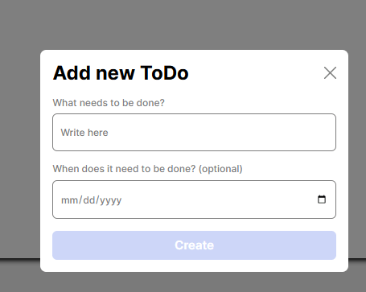
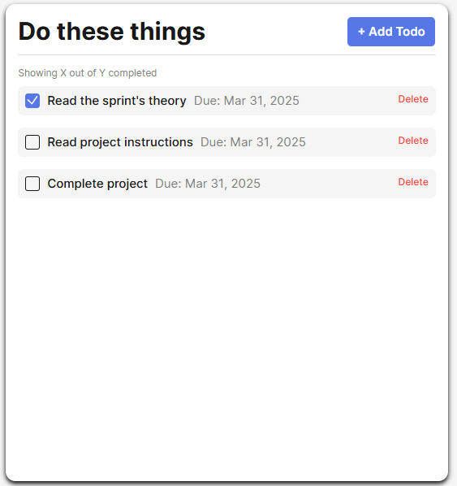

# Simple Todo App

This is The Simple ToDo App. Here you can add Todos and set due dates for each Todo. As you complete each Todo, you can mark the checkbox or delete them.

## Functionality

This ToDo App was created in order to keep track of daily tasks. You can use this to make a list of chores, or track assignments for class or work. With the optional due date feature, you can keep track of deadlines and avoid missed or late assignments.

## Technologies

- Semantic HTML5
- Flexbox
- Grid layout
- @media queries
- validationConfig object
- FormValidator and Todo classes
- Exports and Imports

## Images

## Deployment

This project is deployed on GitHub Pages:

- [Link to Project](https://jayniech.github.io/se_project_todo-app/)
